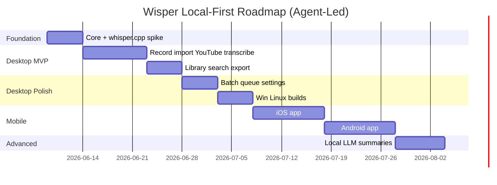

# Wisper — Development Roadmap (Local-First)

**Goal:** Full local clone of Whisper Notes — privacy-first, cross-platform, no cloud transcription.

**Time estimates** are calibrated for **AI agent–led development** (Cursor agent sessions), not a traditional human team. Assumptions:

| Unit | Meaning |
|------|---------|
| **Agent session** | ~2–4 hours of focused agent coding + your review/approval |
| **Agent-day** | ~3–5 agent sessions in one calendar day (with you available to test) |
| **Calendar week** | Includes build toolchain setup, model downloads (~1.2GB), and manual QA on your machine |

Human bottlenecks (signing certificates, App Store review, physical device testing) are called out separately.

---

## Phase overview

---

## Phase 0 — Foundation & proof (Agent: 3–4 days | Calendar: ~1 week)

**Goal:** Prove whisper.cpp transcribes a local file on your machine inside a minimal Tauri shell.

| Task | Agent sessions | Deliverable |
|------|----------------|-------------|
| Repo scaffold (Tauri 2 + React + Rust workspace) | 1 | `wisper/` monorepo builds |
| whisper.cpp submodule + Rust bindings | 1–2 | `transcribe(path) → text` CLI |
| Download large-v3-turbo model + test WAV | 0.5 | Golden transcript on sample audio |
| Minimal UI: pick file → show transcript | 1 | Desktop window with end-to-end flow |

**Exit criteria:**
- [x] One imported WAV → timestamped text on screen
- [x] Zero network calls during transcription (verify with firewall)
- [x] Runs on your primary OS (Windows or Mac)

**Agent instruction:** *"Spike wisper-core: whisper.cpp binding, 16kHz pipeline, one Tauri command `transcribe_file`."*

---

## Phase 0.5 — GPU foundation (Agent: 4–6 days | Calendar: ~1–2 weeks) **← current focus**

**Goal:** Solid **cross-desktop** GPU story (Windows, macOS, Linux) before Phase 1 — avoid retrofitting acceleration later.

**Decisions locked:**
- **All three desktop OSes are first-class** — same release matrix shape on Windows and Linux; Metal on macOS.
- **Ship full release matrix** (Vulkan + CUDA + Metal artifacts; CPU fallback builds).
- **Intel GPU → Vulkan build** on Windows and Linux (not SYCL as primary).
- **CI:** CPU smoke (Linux) + macOS Metal + Windows Vulkan + **Linux Vulkan**.

| Task | Priority | Agent sessions | Status |
|------|----------|----------------|--------|
| Cargo features: `gpu-vulkan`, `gpu-cuda`, `gpu-sycl` + compile-time mutual exclusion | P0 | 0.5 | Done |
| Metal on macOS (Apple Silicon + Intel Mac) | P0 | 0.5 | Done |
| `ComputeInfo` / UI backend labels | P0 | 0.5 | Done |
| Windows `dev.ps1` multi-backend (`-GpuBackend auto/vulkan/cuda/cpu`) | P0 | 1 | Done |
| `GPU_BACKENDS.md` + CHANGELOG + README updates | P0 | 0.5 | Done |
| Verify CUDA build on NVIDIA hardware | P0 | 1 | Todo |
| Verify Metal build on macOS (Intel + Apple Silicon if available) | P0 | 1 | Todo |
| Linux `dev-linux.sh` + Vulkan/CUDA path | P0 | 1 | Done |
| Tauri Linux dependency check in `dev-linux.sh` | P0 | 0.5 | Done |
| Verify Linux Vulkan build (Ubuntu/Fedora) | P0 | 1 | Todo |
| Release naming + About screen shows compiled backend | P1 | 0.5 | Todo |
| GitHub Actions: CPU smoke test | P0 | 1 | Todo |
| GitHub Actions: macOS Metal build | P0 | 1 | Todo |
| GitHub Actions: Linux Vulkan build | P0 | 1 | Todo |
| GitHub Actions: Windows Vulkan build | P0 | 1–2 | Todo |
| Download page / README: which artifact for which GPU | P1 | 0.5 | Todo |
| Deprecate or hide `gpu-sycl` from primary matrix (keep for advanced) | P2 | 0.5 | Todo |

**Exit criteria:**
- [ ] Verified GPU paths on **all desktop OSes**: Windows (Vulkan + CUDA), macOS (Metal), Linux (Vulkan + CUDA)
- [ ] CI green: CPU smoke (Linux) + macOS Metal + Windows Vulkan + Linux Vulkan
- [ ] `dev.ps1`, `dev-macos.sh`, and `dev-linux.sh` documented and working
- [ ] User can identify which build they installed (About / compute panel)
- [ ] No Phase 1 work blocked by GPU or platform ambiguity

**Agent instruction:** *"Complete Phase 0.5 per GPU_BACKENDS.md. Do not start YouTube or mic features until exit criteria pass."*

---

## Phase 0.6 — Apple Core ML encoder (Agent: 2–3 days | Calendar: ~1 week)

**Goal:** Faster transcription on Apple Silicon (and compatible Intel Macs) via Core ML encoder — **after** Metal ggml foundation is stable.

| Task | Priority | Agent sessions |
|------|----------|----------------|
| Evaluate whisper-rs `coreml` feature vs WhisperKit | P0 | 0.5 |
| Core ML model packaging / first-run download | P0 | 1 |
| Fallback to Metal ggml when Core ML unavailable | P0 | 0.5 |
| Benchmark: 30-min file Metal vs Core ML | P1 | 0.5 |

**Exit criteria:**
- [ ] Measurable speedup on M-series vs Metal-only build
- [ ] Graceful fallback when Core ML model missing

---

## Phase 1 — Core desktop MVP + YouTube (P0) (Agent: 7–9 days | Calendar: ~2 weeks)

**Goal:** Whisper Notes core loop plus the “paste a YouTube link” magic moment — all transcription on-device.

| Task | Priority | Agent sessions |
|------|----------|----------------|
| Microphone record (start/pause/stop) via cpal | P0 | 1–2 |
| Save recording to app data dir | P0 | 0.5 |
| Import MP3/M4A/WAV via file picker + drag-drop | P0 | 1 |
| Video import (MP4/MOV) — extract audio locally | P0 | 1–2 |
| **Home screen URL field + YouTube paste import** | **P0** | **1–2** |
| **`wisper-core/fetch`: bundle yt-dlp, download audio locally** | **P0** | **1–2** |
| **Store source URL, title, channel in SQLite** | **P0** | 0.5 |
| **UI: download progress → transcribe progress (two-step)** | **P0** | 0.5 |
| **Label items: “Downloaded from URL” vs “Fully offline”** | **P0** | 0.5 |
| Transcription job queue + progress UI | P0 | 1 |
| Language select + auto-detect | P0 | 0.5 |
| Transcript view with timestamps | P0 | 1 |
| Inline segment editing + save | P0 | 1 |
| SQLite persistence (`wisper-core/storage`) | P0 | 1–2 |

**Exit criteria:**
- [ ] Record 2-min voice memo → local transcript (no cloud STT)
- [ ] Import 30-min MP3 → transcript with timestamps
- [ ] **Paste public YouTube lecture URL → download → local transcript (no cloud STT)**
- [ ] Edit and reload persists after app restart
- [ ] Firewall test: **zero outbound connections during transcription step** (download step may use network)

**Agent instruction:** *"Implement Phase 1 per TECHNICAL_ARCHITECTURE.md. Split crates: `fetch` (yt-dlp, network OK) vs `transcribe` (whisper.cpp, network forbidden)."*

---

## Phase 2 — Library & export (Agent: 4–5 days | Calendar: ~1 week)

**Goal:** Retention surface — find and reuse past transcripts (including YouTube-sourced items).

| Task | Priority | Agent sessions |
|------|----------|----------------|
| Library list (sort by date) | P0 | 1 |
| FTS5 full-text search across all transcripts | P0 | 1–2 |
| Open transcript from library | P0 | 0.5 |
| Export plain text (.txt) | P0 | 0.5 |
| Copy to clipboard | P0 | 0.5 |
| Export SRT + VTT with timestamps | P1 | 1 |
| Export Markdown with YAML frontmatter | P1 | 0.5 |
| Other yt-dlp-supported URLs (podcasts, direct links) | P1 | 0.5 |
| Tags + filter by language/date/source (incl. YouTube) | P1 | 1 |
| Delete recording + transcript | P1 | 0.5 |

**Exit criteria:**
- [ ] Search finds matches across 10+ transcripts instantly (including YouTube imports)
- [ ] SRT exports open correctly in video editor

---

## Phase 3 — Desktop polish & Whisper Notes parity (Agent: 4–5 days | Calendar: ~1 week)

**Goal:** Batch processing, settings, and UX matching Whisper Notes desktop expectations.

| Task | Priority | Agent sessions |
|------|----------|----------------|
| Batch import queue (sequential) | P1 | 1 |
| Model manager (download, switch quality/speed) | P1 | 1–2 |
| Settings: delete audio after transcribe | P1 | 0.5 |
| Settings: paragraph break heuristics | P1 | 1 |
| First-run onboarding (download model, mic permission) | P1 | 1 |
| Background transcription (desktop) | P1 | 1 |
| App icon, installer, auto-update stub | P2 | 1 |

**Exit criteria:**
- [ ] Queue 5 files overnight; all transcribed locally
- [ ] User can choose smaller model on 8GB RAM machine

---

## Phase 4 — Cross-platform desktop (Agent: 4–6 days | Calendar: ~1–2 weeks)

**Goal:** Windows + Linux ship alongside macOS.

| Task | Platform | Agent sessions |
|------|----------|----------------|
| Windows build + CUDA/Vulkan **release matrix** | Windows | 2–3 |
| Linux AppImage build + CPU fallback | Linux | 1–2 |
| macOS Apple Silicon Core ML path | macOS | 2 |
| CI matrix (GitHub Actions) | All | 1–2 |
| Network-off automated test in CI | All | 1 |

**Exit criteria:**
- [ ] Installers for Win + Mac + Linux
- [ ] Transcription works offline on all three

**Human bottleneck:** Code signing (Mac/Win) — 1–3 calendar days, mostly you.

---

## Phase 5 — iOS app (Agent: 8–10 days | Calendar: ~2–3 weeks)

**Goal:** Native iPhone app matching Whisper Notes iOS experience.

| Task | Agent sessions |
|------|----------------|
| SwiftUI shell (record, **YouTube URL**, import, library) | 2 |
| WhisperKit integration OR whisper.cpp Core ML | 2–3 |
| **YouTube URL import via yt-dlp (P0 parity with desktop)** | 1–2 |
| Share extension (import from Voice Memos, Safari share, etc.) | 1–2 |
| On-first-run model download (~1.2GB) | 1 |
| SQLite parity with desktop schema | 1 |
| Export TXT/SRT share sheet | 1 |
| TestFlight build config | 1 |

**Exit criteria:**
- [ ] iPhone 12+ transcribes imported M4A and **YouTube URL** fully on-device (download may use network; transcribe does not)
- [ ] No network entitlement required for core features

**Human bottleneck:** Apple Developer account, device testing, App Store review — 1–2 weeks calendar.

---

## Phase 6 — Android app (Agent: 8–10 days | Calendar: ~2–3 weeks)

**Goal:** Android parity with adaptive model download.

| Task | Agent sessions |
|------|----------------|
| Compose UI (mirror iOS flows incl. **YouTube URL field**) | 2 |
| whisper.cpp JNI (upstream android example) | 2–3 |
| **YouTube URL import via yt-dlp (P0 parity)** | 1–2 |
| Scoped storage + SAF import | 1–2 |
| Model download manager | 1 |
| Background work (WorkManager) | 1–2 |
| Export + share intents | 1 |

**Exit criteria:**
- [ ] Pixel/Samsung mid-range transcribes offline after model download

---

## Phase 7 — Advanced local features (Agent: 5–7 days | Calendar: ~1–2 weeks)

**Goal:** Optional power features without breaking privacy.

| Task | Priority | Agent sessions |
|------|----------|----------------|
| System audio capture (meetings) — desktop | P2 | 2–3 |
| Basic speaker split (mic vs system) | P2 | 1–2 |
| Local summaries via llama.cpp (small model) | P2 | 2–3 |
| `.wisper` bundle export/import for backup | P2 | 1 |
| Real-time partial transcription (streaming) | P2 | 3+ |

**Note:** Whisper Notes intentionally ships **batch-first**, not live captions. Match that for v1 parity; streaming is v2+.

---

## Total estimates (agent-led)

| Milestone | Agent-days | Calendar (with you testing) |
|-----------|------------|----------------------------|
| Phase 0 — Spike | 3–4 | ~1 week |
| Phase 1 — Desktop MVP + YouTube (P0) | 7–9 | ~2 weeks |
| Phase 2 — Library/export | 4–5 | ~1 week |
| Phase 3 — Polish | 4–5 | ~1 week |
| Phase 4 — Win/Linux | 4–6 | ~1–2 weeks |
| **Desktop complete** | **~22–29 agent-days** | **~6–8 weeks** |
| Phase 5 — iOS | 8–10 | ~2–3 weeks |
| Phase 6 — Android | 8–10 | ~2–3 weeks |
| **All major platforms** | **~36–47 agent-days** | **~10–14 weeks** |
| Phase 7 — Advanced | 5–7 | ~1–2 weeks |

---

## What to build first (recommended order)

1. **Phase 0 spike** — validate whisper.cpp on your daily OS *(done)*  
2. **Phase 0.5 GPU foundation** — multi-backend builds, CI, release matrix **before Phase 1**  
3. **Phase 0.6 Core ML** — Apple encoder acceleration  
4. **Phases 1–2** — desktop MVP with YouTube paste, library, export  
5. **Phase 4** — Linux release parity + installer polish  
6. **Phases 5–6** — mobile when desktop is stable  
7. **Phase 7** — only after core is shippable  

---

## Parallel agent workstreams (when ready)

After Phase 0, these can run in parallel with coordination:

| Stream A | Stream B |
|----------|----------|
| `wisper-core` Rust crate | React UI components |
| whisper.cpp bindings | SQLite schema + migrations |
| Export formats | Library search UI |

**Rule:** Agent merges to `main` only after network-off transcribe test passes.

---

## Success metrics (local-first)

| Metric | Target |
|--------|--------|
| Transcription completion rate | >90% of started jobs |
| Offline functionality | Record + local file import work in airplane mode (after model install) |
| Outbound connections during transcribe | **0** |
| YouTube URL → local transcript (P0) | >85% success on valid public URLs |
| 30-min file → transcript (M-series Mac / RTX GPU) | <5 min |
| 30-min file → transcript (8GB CPU-only) | <20 min |
| Library search latency | <100ms for 1,000 transcripts |

---

## Out of scope (entire project)

- Cloud transcription APIs (OpenAI Whisper API, etc.)
- User accounts, login, cloud sync
- Sending downloaded or recorded audio to third-party STT services
- Analytics on audio content
- Subscription backend
- Speaker diarization (v1) — deferred to Phase 7+

**In scope:** YouTube and other URL import via **local download (yt-dlp)** → **on-device transcription**.

## Next action

**Current:** Phase 0.5 — finish GPU foundation (see table above). Start with CI smoke test + CUDA verification on NVIDIA hardware if available.

When Phase 0.5 exit criteria pass, resume Phase 1:

> Implement Phase 1 per TECHNICAL_ARCHITECTURE.md. Split crates: `fetch` (yt-dlp, network OK) vs `transcribe` (whisper.cpp, network forbidden). YouTube URL field on home screen.
