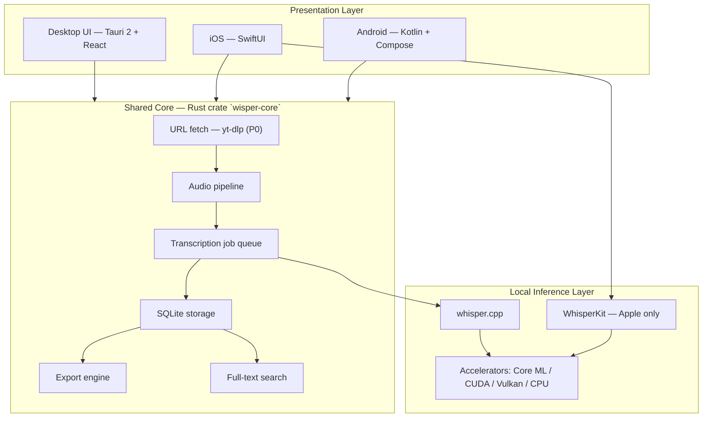
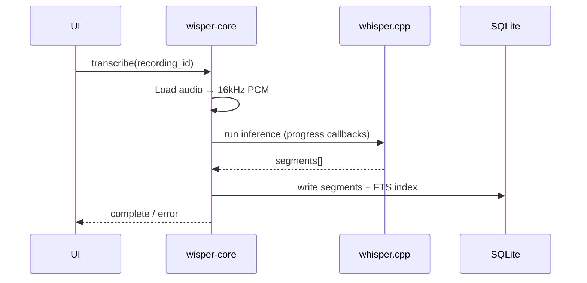

# Wisper — Technical Architecture (Local-First)

**Product:** Full local clone of Whisper Notes  
**Principle:** Privacy by architecture — transcription never uses the cloud. Audio and transcripts are never sent to a STT API. Network is used only when the user pastes a URL (YouTube download via yt-dlp) or installs the Whisper model. No accounts required.

**Reference:** [Whisper Notes](https://whispernotes.app/whisper-app) (on-device Whisper Large V3 Turbo, Core ML / Neural Engine, batch transcription, local library)

---

## 1. Architecture overview



### Design decisions

| Decision | Choice | Rationale |
|----------|--------|-----------|
| Inference engine | **whisper.cpp** (primary) | Cross-platform C++, GPU backends, same model format (GGML), reference iOS/Android/desktop examples |
| Apple acceleration | **WhisperKit** on iOS/macOS (optional path) | Better Neural Engine utilization than raw whisper.cpp on Apple Silicon |
| Desktop shell | **Tauri 2** | Native binary, Rust backend, single codebase for Windows/macOS/Linux |
| Mobile (Apple) | **SwiftUI + wisper-core via FFI** or WhisperKit directly | Native mic/import, sandbox, no WebView limits |
| Mobile (Android) | **Kotlin + whisper.cpp JNI** | Matches upstream Android example patterns |
| Storage | **SQLite** (+ WAL) | Fast local search, proven in indie transcription apps |
| Network | **YouTube/URL download only (user-initiated); never for STT** | yt-dlp fetch is P0; transcribe crate has no HTTP client |
| AI summaries (v2) | **Local LLM via llama.cpp** | Keeps privacy promise; cloud LLM is a non-goal |

---

## 2. Platform matrix

| Platform | Shell | Inference | Min hardware | Notes |
|----------|-------|-----------|--------------|-------|
| **macOS** | Tauri 2 | whisper.cpp + Metal (+ Core ML Phase 0.6) | Apple Silicon or Intel Mac, 8GB RAM | Metal on all supported Macs; Core ML encoder after GPU foundation |
| **Windows** | Tauri 2 | whisper.cpp + CUDA / Vulkan / CPU | 8GB RAM, optional GPU | CUDA for NVIDIA; Vulkan default for AMD/Intel; same matrix as Linux |
| **Linux** | Tauri 2 | whisper.cpp + CUDA / Vulkan / CPU | 8GB RAM | **Equal desktop priority** — AppImage / .deb; Vulkan for AMD/Intel |
| **iOS** | Native SwiftUI | WhisperKit or whisper.cpp Core ML | iPhone 12+ | Background transcription limited by iOS GPU policy |
| **Android** | Native Kotlin | whisper.cpp + NNAPI / GPU | 6GB+ RAM, mid-range SoC | Model size affects APK vs on-first-run download |

**Explicit non-target for v1:** Browser-only WASM transcription as primary product (4GB memory cap, smaller models only). May ship as demo later, not parity with desktop.

---

## 3. Audio pipeline

```
Input (mic | file | video)
    → Decode (symphonia / ffmpeg-static / AVFoundation / MediaCodec)
    → Resample to 16 kHz mono PCM (Whisper requirement)
    → Optional: Silero VAD — strip silence for long files
    → Chunk for model context window
    → whisper.cpp / WhisperKit inference
    → Segment list { start_ms, end_ms, text, confidence? }
    → Persist to SQLite
    → Render in UI with seek/sync
```

### Supported inputs (MVP)

| Type | Formats / sources |
|------|-------------------|
| Audio (local) | MP3, M4A, WAV, FLAC, AAC, OGG |
| Video (local) | MP4, MOV (audio track extracted locally) |
| **URL import (YouTube)** | **YouTube** (P0), plus other yt-dlp sites (P1) |

### YouTube / URL import (P0 — local-first)

Network is used **only to download media the user explicitly requests**. Transcription never uses the network.

```
User pastes URL (YouTube, etc.)
    → Validate URL + show title/thumbnail (optional metadata fetch)
    → yt-dlp: download best audio stream to app data dir
    → Same pipeline as local file: decode → 16 kHz → whisper.cpp
    → Store source_url + title in SQLite; audio optional retention
    → Transcribe with zero outbound connections
```

| Component | Choice |
|-----------|--------|
| Downloader | **yt-dlp** (bundled binary per platform or sidecar in Tauri resources) |
| Audio format | Prefer m4a/opus/webm → convert to WAV/PCM locally |
| Metadata | Title, channel, duration, thumbnail path stored with recording |
| Privacy UI | Label items as “Downloaded from URL” vs “Fully offline” |
| Failure modes | Geo-block, age-restricted, private video — clear error + retry |

**Not in scope for URL import:** Sending audio to any STT API; storing URLs on our servers; auto-syncing to cloud.

**Legal / UX:** In-app note that users must comply with YouTube ToS and copyright; app is a personal transcription tool (same category as other Whisper apps with YouTube import).

### Recording

- Desktop: `cpal` (Rust) or platform APIs via Tauri plugins
- Mobile: AVFoundation (iOS), AudioRecord (Android)
- Target: 48 kHz capture → downsample to 16 kHz for model

---

## 4. Model strategy

### Default model

| Property | Value |
|----------|-------|
| Model | **Whisper Large V3 Turbo** |
| Format | GGML / GGUF quantized |
| Quantization | Q5_0 desktop default (~600MB–1.2GB depending on build) |
| Languages | 99+ (auto-detect) |
| Distribution | Bundled with installer OR first-run download to app data dir (user choice) |

### Fallback models (settings)

| Profile | Model | Use case |
|---------|-------|----------|
| **Quality** | large-v3-turbo Q5 | Default; matches Whisper Notes positioning |
| **Balanced** | small.en Q5 | Low-RAM machines |
| **Fast** | base.en Q8 | Quick drafts on weak hardware |

### Accelerator selection

**Runtime (today):** User toggles **CPU** or **GPU** in the desktop UI. `WhisperContextParameters.use_gpu` is set accordingly. On GPU failure, Wisper invalidates the GPU context and retries once on CPU.

**Compile time (today):** whisper.cpp links **one** GPU backend per binary. Cargo features select the backend:

| Build | Feature / platform | Backend |
|-------|-------------------|---------|
| macOS | `target_os = "macos"` | Metal (Apple Silicon + Intel Mac) |
| Windows / Linux | `gpu-vulkan` | Vulkan (AMD, Intel iGPU, NVIDIA) |
| Windows / Linux | `gpu-cuda` | NVIDIA CUDA |
| Optional | `gpu-sycl` | Intel oneAPI (advanced; not primary for Intel) |

**Release matrix (planned):** Separate installers per backend — see [GPU_BACKENDS.md](./GPU_BACKENDS.md).

**Future (Phase 0.6+):** Runtime hardware probe to recommend the correct download variant; Apple **Core ML** encoder path on macOS (in addition to Metal ggml).

```
# Aspirational runtime selection (not yet implemented)
if macOS && CoreML model present → Core ML encoder
else if build includes CUDA && NVIDIA GPU present → use GPU (CUDA build)
else if build includes Vulkan → use GPU (Vulkan build)
else if build includes Metal → use GPU (Metal build)
else → CPU
```

---

## 5. Data layer

### SQLite schema (simplified)

```sql
-- recordings
CREATE TABLE recordings (
  id            TEXT PRIMARY KEY,
  title         TEXT NOT NULL,
  created_at    INTEGER NOT NULL,
  duration_ms   INTEGER,
  source        TEXT,  -- 'mic' | 'import' | 'url'
  source_url    TEXT,  -- original YouTube/media URL if applicable
  audio_path    TEXT,  -- local file path (optional retention)
  language      TEXT,
  model_id      TEXT
);

-- transcript_segments
CREATE TABLE transcript_segments (
  id            INTEGER PRIMARY KEY,
  recording_id  TEXT REFERENCES recordings(id),
  start_ms      INTEGER NOT NULL,
  end_ms        INTEGER NOT NULL,
  text          TEXT NOT NULL
);

-- transcripts_fts (FTS5 for search)
CREATE VIRTUAL TABLE transcripts_fts USING fts5(
  recording_id, text, content='transcript_segments', content_rowid='id'
);

-- tags (optional P1)
CREATE TABLE tags (
  recording_id TEXT,
  tag          TEXT
);
```

### File layout (app data directory)

```
~/.wisper/   (or OS-equivalent app sandbox)
  models/
    ggml-large-v3-turbo.bin
  audio/
    {recording_id}.wav
  exports/
  wisper.db
```

### Privacy constraints

- No outbound HTTP in core transcription path (enforce in CI with network-off tests)
- No third-party analytics SDKs
- Optional: user can delete audio after transcription, keep text only
- OS-level sandbox (Tauri / mobile sandboxes)

---

## 6. Application layers

### 6.1 `wisper-core` (Rust)

Shared library used by Tauri and potentially mobile via FFI.

| Module | Responsibility |
|--------|----------------|
| `audio` | Decode, resample, VAD hooks |
| `transcribe` | whisper.cpp bindings, job queue, progress callbacks |
| `storage` | SQLite CRUD, FTS search |
| `export` | TXT, SRT, VTT, DOCX (minimal), Markdown + YAML frontmatter |
| `models` | Model discovery, download (one-time), validation |
| `fetch` | URL validation, yt-dlp subprocess, download progress |

### 6.2 Desktop — Tauri 2

```
src-tauri/
  src/
    main.rs          # Tauri commands → wisper-core
  wisper-core/       # Rust crate (or workspace member)
src/                 # React + TypeScript UI
  pages/
    Home.tsx         # Record + **YouTube URL field** + file import
    Library.tsx      # Search + list
    Transcript.tsx   # Edit + export + timestamps
```

**Key Tauri commands:**

- `start_recording` / `stop_recording`
- `import_files(paths: Vec<String>)`
- `import_url(url: String)` — YouTube / yt-dlp-supported links
- `transcribe(recording_id, options)`
- `get_transcript(recording_id)`
- `update_segment(segment_id, text)`
- `search_library(query)`
- `export(recording_id, format)`

### 6.3 iOS / macOS native (Phase 4+)

- SwiftUI app shell
- WhisperKit for inference on Apple platforms
- Shared export format compatible with desktop (import/export `.wisper` bundle or Markdown sync via user-controlled folder)

### 6.4 Android (Phase 5+)

- Jetpack Compose UI
- whisper.cpp via JNI (upstream `whisper.android` reference)
- Scoped storage compliance

---

## 7. Transcription job flow



- Jobs run **one at a time** (memory: 2–3GB peak during large model)
- Queue supports batch import (sequential processing)
- Cancel: cooperative — stop between chunks
- Retry: re-run from cached PCM if audio retained

---

## 8. Feature parity map (Whisper Notes)

| Whisper Notes feature | Wisper approach | MVP? |
|----------------------|-----------------|------|
| Record voice | Platform audio APIs | P0 |
| Import audio files | Local file picker + drag-drop | P0 |
| Offline transcription | whisper.cpp / WhisperKit | P0 |
| Whisper Large V3 Turbo | Bundled/downloaded GGML model | P0 |
| Timestamped transcript | Segment storage | P0 |
| Edit transcript | Inline segment edit | P0 |
| Library + search | SQLite + FTS5 | P0 |
| Export TXT | Core export module | P0 |
| Export SRT / VTT | Core export module | P1 |
| Paragraph formatting | Post-process segments | P1 |
| Batch file queue | Job queue | P1 |
| No network permissions | Architecture + store review | P0 |
| Speaker labels (Me/Others) | Mic vs system audio (desktop Phase 3) | P2 |
| AI summaries | Local llama.cpp (v2) | P2 |
| Real-time during recording | Deferred (Whisper Notes also batch-first) | P2 |
| YouTube / URL import | yt-dlp download → local transcribe; **P0 on home screen** | **P0** |
| Cloud sync / accounts | **Non-goal** | — |

---

## 9. Security & privacy

| Threat | Mitigation |
|--------|------------|
| Audio exfiltration to STT cloud | No remote STT APIs; transcription crate has no upload code |
| URL download scope creep | Network only in `fetch` module; user-initiated URL only |
| Compromised app phoning home | No Wisper-owned servers; optional firewall-friendly |
| Local data access | OS sandbox; encrypt DB at rest (OS keychain-derived key) — P1 |
| Supply chain | Pin whisper.cpp commit; verify model checksums on download |
| Sensitive professions (HIPAA, legal) | Marketing: local-first by architecture, not policy |

---

## 10. Build & release

| Platform | Artifact | Model packaging |
|----------|----------|-----------------|
| macOS | `.dmg` (universal Apple Silicon) | Separate model download or bundled (~1.2GB) |
| Windows | `.msi` / NSIS installer | First-run model download recommended |
| Linux | AppImage | First-run model download |
| iOS | App Store | On-demand model download (App Store size limits) |
| Android | Play Store / APK | On-demand model download |

### CI pipeline

1. Rust `cargo test` + `clippy`
2. UI `vitest` / Playwright smoke
3. Integration test: sample WAV → transcript golden file (CPU, tiny model in CI)
4. Network-off test: assert zero outbound connections during transcribe
5. Platform matrix builds (GitHub Actions)

---

## 11. Technology stack summary

| Layer | Technology |
|-------|------------|
| UI (desktop) | React 19, TypeScript, Tailwind |
| Desktop shell | Tauri 2 |
| Core logic | Rust (`wisper-core`) |
| Inference | whisper.cpp, WhisperKit (Apple) |
| Audio decode | symphonia / ffmpeg-static |
| URL download | yt-dlp (bundled per platform) |
| Database | SQLite + FTS5 (`rusqlite`) |
| iOS | SwiftUI, WhisperKit |
| Android | Kotlin, Compose, whisper.cpp JNI |
| Local LLM (v2) | llama.cpp |

---

## 12. Open engineering questions

1. **Model delivery:** Bundle in installer (simple, large download) vs first-run download (smaller installer, needs one-time network)?
2. **Intel Mac support:** Whisper Notes excludes Intel — do we support CPU-only with smaller model?
3. **System audio capture (meetings):** Windows WASAPI loopback vs macOS ScreenCaptureKit — phase 3 desktop feature
4. **Cross-device sync:** User-controlled export folder (iCloud/Dropbox) vs no sync — recommend latter for privacy
5. **YouTube on mobile:** Share extension “Transcribe in Wisper” vs in-app URL field — both?

---

## 13. Related documents

- `ROADMAP.md` — phased delivery with AI-agent time estimates
- `Aisling Copy of 20260515 PRD Template - FILLED.docx` — product requirements (local-first)
