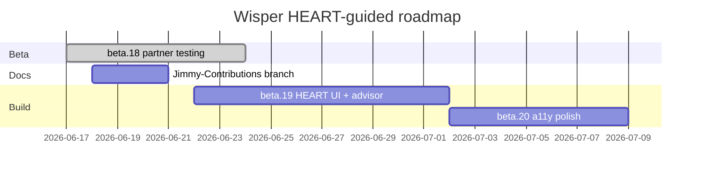

# Aisling Corrections — Week 2 PRD Reconciliation

**Author:** Aisling (with Cursor review of Jimmy’s Claude Code package)  
**Date:** June 17, 2026  
**Baseline app:** `v0.2.0-beta.18` on `master`  
**Jimmy source:** `files (3).zip` → `Wisper_Week2_PRD_FINAL_CORRECTED.md` + review docx (branch `Jimmy-fixes` not yet on GitHub)  
**Status:** Decisions locked (June 17, 2026) — **UI/UX refresh approved**; implement on `Jimmy-Contributions` → beta.19+ using [HEART framework](#5-heart-framework--wisper-ux-north-star)

---

## How to use this document

| Section                                                              | Purpose                                                         |
| -------------------------------------------------------------------- | --------------------------------------------------------------- |
| [1. Corrections](#1-corrections-to-jimmys-week-2-prd)                | What to change in the *plan* before any more code               |
| [2. Review of corrections](#2-review-of-these-corrections)           | Sanity-check: why these corrections are right, risks if ignored |
| [3. Implementation guide](#3-how-to-implement-the-corrected-changes) | Concrete engineering steps (Tauri-aware, file-level)            |
| [4. Roadmap](#4-plan-of-action--roadmap)                             | Phased delivery, owners, exit criteria                          |
| [5. HEART framework](#5-heart-framework--wisper-ux-north-star)       | UX metrics north star (Goals → Signals → Metrics)               |
| [Appendix A](#appendix-a-decision-log)                               | Locked decisions vs open questions                              |

---

## Executive summary

Jimmy’s review tightened a **1,100-line PRD** and fixed **25 real ambiguities** (disabled-button tooltips, GPU fallback wording, activation metrics, yt-dlp scope, etc.). That work is **valuable as a spec**, but it is **not aligned** with what Wisper already shipped in **beta.15–beta.18** and it contains **stack errors** (Electron vs Tauri).

**Aisling’s position (updated):** Accept Jimmy’s *quality bar*, reconcile against beta.18, and **ship a HEART-guided UI/UX refresh** in beta.19–20: model tier choice with **hardware spec reader + optional micro-benchmark**, Advanced options (**remember open** = Option B), and task-success-focused first-run flow — **no file size caps**, **no full analytics suite** until cohort grows.

---

## 1. Corrections to Jimmy’s Week 2 PRD

Each item: **Jimmy PRD says** → **Aisling correction** → **Severity**

### 1.1 Baseline reality (what already shipped)

| #   | Jimmy PRD assumption                          | Aisling correction                                                                                                                                                                                              |
| --- | --------------------------------------------- | --------------------------------------------------------------------------------------------------------------------------------------------------------------------------------------------------------------- |
| C1  | Week 2 is greenfield UI                       | **beta.15** already shipped: welcome guide, one-click model download, Record/Choose file up front, Advanced collapsed behind link. **beta.17–18** added update checks. Treat PRD as **delta**, not replacement. |
| C2  | Non-goal: “in-app model download is separate” | **Incorrect vs product.** Model download exists in `WelcomeGuide.tsx` via `start_model_download`. PRD must describe **guide + main screen**, not only “hero banner.”                                            |
| C3  | New `EmptyStateHero.tsx` is P0                | **Downgrade to P1 optional refactor.** Current transcribe panel in `App.tsx` already works. Extract component only if hero layout changes materially.                                                           |
| C4  | 13 analytics events in MVP                    | **Defer to Phase 1.5.** No analytics pipeline in app today. Manual QA + partner notes suffice for current beta cohort.                                                                                          |
| C5  | `preferences.json` via Electron `app.getPath` | **Wrong stack.** Wisper is **Tauri 2**. Use `app.path().app_data_dir()` (Rust) + optional thin `preferences.json` there, or continue `localStorage` for UI-only prefs (see C6).                                 |

### 1.2 Technical accuracy

| #   | Issue                                                     | Aisling correction                                                                                                                                                                                                                                                                  |
| --- | --------------------------------------------------------- | ----------------------------------------------------------------------------------------------------------------------------------------------------------------------------------------------------------------------------------------------------------------------------------- |
| C6  | Pin Advanced persists in config file                      | **Option B accepted:** checkbox *“Keep Advanced options open on this computer”* → `localStorage` (`wisper-keep-advanced-open`). No pin icon for beta. Option C (Tauri prefs file) **deferred**.                                                                                     |
| C7  | File paths `~/.config/wisper` on Windows                  | **Use Tauri app data dir** (already used for models, DB, audio in `src-tauri/src/lib.rs`). Document actual paths in PRD footnote.                                                                                                                                                   |
| C8  | GPU fallback “pauses at checkpoint”                       | **Already corrected in Jimmy’s final PRD.** Keep: “restarts on CPU from beginning.” Matches current `fallbackNotice` UX in `App.tsx`.                                                                                                                                               |
| C9  | File size “1 GB ≈ 6 hours” vs table showing 18h @ 128kbps | **Reject hard caps (Aisling decision).** Wisper is a local app — do **not** enforce upload, URL, recording, or model download size limits in the UI. Jimmy’s hour estimates are documentation-only if kept at all. Optional: warn on very large files (informational), never block. |
| C16 | Model download is fixed to `base` in welcome guide        | **Add user-facing model tier selector:** Small / Medium / Large (labels **confirmed**). Pair with **hardware advisor** (C17) — suggest tier, user can override.                                                                                                                     |

### 1.3 UX model: one coherent first-run story

Jimmy’s PRD describes **Scenario B**: model-download banner fused with hero. The app uses **modal welcome guide** (Scenario C).

| #   | Aisling correction                                                                                                                                                                                                                                                                                               |
| --- | ---------------------------------------------------------------------------------------------------------------------------------------------------------------------------------------------------------------------------------------------------------------------------------------------------------------- |
| C10 | **Do not build a second model-download UX.** Either extend the guide *or* add a slim inline banner on the main screen when model missing — **not both**. **Recommendation:** keep guide for first run; on return visits without model, show **inline banner** on transcribe panel (reuse guide download invoke). |
| C11 | Add **persistent privacy subtitle** on main screen (Jimmy P1): *“Transcription runs locally on your device. No data leaves your computer.”* — currently only in guide copy. **Adopt.**                                                                                                                           |
| C12 | Rename UI copy **“Advanced settings”** → **“Advanced options”**                                                                                                                                                                                                                                                  |

### 1.4 Scope discipline (what to keep from the “25 fixes”)

**Keep in corrected spec (implement):**

- Disabled controls: `pointer-events: none`, `#999999` text, help text near banner — **not tooltips on disabled buttons**
- Activation metric: **start** transcription, not complete in session 1
- yt-dlp: direct audio URL vs YouTube/SoundCloud branching
- Recording: disable Record during model/URL download; collapse Advanced while recording
- File remove disabled during transcription
- Escape closes Advanced; confirm if URL field dirty (**P1**)
- Error messages persist until resolved (audit current `error` state in `App.tsx`)
- **Model tier selector** Small / Medium / Large (**P0**, labels confirmed)
- **Hardware advisor** spec reader + optional benchmark + recommendation (**P0**, Aisling)
- **Advanced remember-open** Option B checkbox (**P1**)

**Explicitly out (Aisling):**

- **No file size limits** on file upload, URL import, recording length, or model download size
- Jimmy PRD 1 GB file cap — **do not implement**

**Defer (document only, Week 3+):**

- Pin Advanced Option C (Tauri config file + pin icon)
- Language confidence <75% banner after transcribe
- Recording crash recovery
- Full analytics event suite
- Keyboard shortcuts Ctrl+R / Ctrl+O
- Settings page “always show Advanced”
- Figma gate as hard blocker (use screenshots + beta.18 as living mockup until Figma exists)

### 1.6 Model tier selector (Aisling priority)

Jimmy’s PRD focused on hero layout; Aisling’s answer on “hero layout” is really a **model choice** requirement for heterogeneous hardware.

| UI label   | Maps to                                   | Approx. size | Best for                              |
| ---------- | ----------------------------------------- | ------------ | ------------------------------------- |
| **Small**  | `tiny` → `ggml-tiny.en.bin`               | ~75 MB       | Weak CPU, quick tests, low RAM        |
| **Medium** | `base` → `ggml-base.en.bin`               | ~150 MB      | Default balance (current app default) |
| **Large**  | `large-turbo` → `ggml-large-v3-turbo.bin` | ~1.6 GB      | Strong GPU/CPU, best accuracy         |

**Where it appears:** Welcome guide (Step 1), Advanced options (change/re-download model), and optional inline banner when no model is present.

**Backend today:** `StarterModel` in `wisper-core` only supports `tiny` and `base`. `download-model.ps1` already knows `large-turbo` — extend Rust enum + `start_model_download` to accept `large-turbo` (or `large`).

**No model size cap** — user picks tier; app shows download size and ETA, does not refuse Large on weak hardware (may warn instead).

### 1.7 Hardware advisor — spec reader + benchmark (Aisling)

Users should not guess Small vs Large. Add a **System check** step in welcome guide (and link from Advanced options).

| Layer                                          | What it does                                                                          | Implementation sketch                                                                                                        |
| ---------------------------------------------- | ------------------------------------------------------------------------------------- | ---------------------------------------------------------------------------------------------------------------------------- |
| **Spec reader**                                | Shows CPU arch, RAM, GPU backend (Metal/CUDA/Vulkan), disk free on models dir         | Extend Rust: `sysinfo` (or Tauri plugins) → new `get_system_profile` command; merge with existing `get_compute_info`         |
| **Micro-benchmark** (optional but recommended) | 5–15 s smoke: load **tiny** model, transcribe bundled 3–5 s WAV, report sec/audio-sec | New `run_compute_benchmark` in `wisper-core`; progress events like model download                                            |
| **Recommendation**                             | Map profile + benchmark to Small / Medium / Large + CPU vs GPU default                | Rule table in Rust (testable); UI: *“Recommended for your Mac: Medium + Metal”* with **Use recommended** / **Choose myself** |

**Rules of thumb (initial, tune with Jimmy data):**

| Profile                                    | Suggested model | Suggested backend       |
| ------------------------------------------ | --------------- | ----------------------- |
| RAM < 8 GB, no GPU build                   | Small           | CPU                     |
| RAM 8–16 GB, GPU available                 | Medium          | GPU (with CPU fallback) |
| RAM ≥ 16 GB, GPU available, benchmark fast | Large           | GPU                     |
| Intel Mac x64, 8 GB RAM                    | Small or Medium | CPU often safer         |

**Privacy:** All local; benchmark runs on device; no telemetry upload in beta (results only in UI + optional export for support).

### 1.5 Process / repo corrections

| #   | Correction                                                                                                                                                     |
| --- | -------------------------------------------------------------------------------------------------------------------------------------------------------------- |
| C13 | Merge `Jimmy-fixes` branch (or `Week2-PRD-Review/`) into repo so review isn’t zip-only.                                                                        |
| C14 | Retitle “Grade 10/10 production-ready” → **“Spec-ready for implementation planning”** — not “app production-ready.”                                            |
| C15 | Add `**Aisling-corrections.md`** (this file) as the **authoritative delta** over `Wisper_Week2_PRD_FINAL_CORRECTED.md` until Jimmy signs off on reconciled v4. |

---

## 2. Review of these corrections

### 2.1 Why these corrections are sound

1. **Avoid duplicate work** — Rebuilding hero + banner + guide would regress beta.15 work testers already have.
2. **Stack honesty** — Electron APIs in the PRD would mislead any implementer; Tauri paths already exist and work.
3. **Beta-appropriate scope** — Jimmy (Intel Mac) and you (Windows CUDA) need **installable builds + clear first path**, not 13 analytics events.
4. **Jimmy’s review still matters** — The 25 issues are mostly **spec hygiene**; adopting them in a *reconciled* doc prevents the *next* slice from repeating beta.15 confusion.

### 2.2 Risks if we ignore these corrections

| Risk                             | Impact                                                                                      |
| -------------------------------- | ------------------------------------------------------------------------------------------- |
| Implement full PRD as written    | 2–3 week rewrite; beta testers stuck on old builds; merge conflicts with `App.tsx` monolith |
| Keep Electron paths              | Broken prefs, wrong docs, failed Mac/Windows paths                                          |
| Two model-download flows         | Users see guide *and* banner; contradictory disabled states                                 |
| “10/10” treated as ship criteria | Never ship; perfectionism on P2 items                                                       |

### 2.3 Risks if we over-correct (things not to throw away)

| Jimmy asset             | Keep because                                                          |
| ----------------------- | --------------------------------------------------------------------- |
| Success metrics table   | Good moderation script for partner testing                            |
| Accessibility section   | Worth incremental adoption (aria-expanded, keyboard)                  |
| Error state catalog     | Use as QA checklist in `phase1-exit-qa.ps1` extensions                |
| Format hints (optional) | Suggest converting video to audio — **warn only**, no upload size cap |

### 2.4 Self-review scorecard

| Dimension                | Jimmy PRD (as-is) | After Aisling corrections |
| ------------------------ | ----------------- | ------------------------- |
| Spec clarity             | 9/10              | 9/10 (unchanged)          |
| Matches beta.18 codebase | 4/10              | 9/10                      |
| Implementable on Tauri   | 5/10              | 9/10                      |
| Beta-sized scope         | 5/10              | 8/10                      |
| Partner-test readiness   | 6/10              | 9/10                      |

**Conclusion:** Corrections don’t discard Jimmy’s work; they **anchor it to shipped reality** and **sequence** the rest.

---

## 3. How to implement the corrected changes

**Prerequisite:** Decisions in Appendix A/B + Section 5 HEART. Work on branch `Jimmy-Contributions`, ship via beta tags.

### Slice A — Documentation & repo (no user-visible change)

**Goal:** Single source of truth for team.

| Task | Action                                                                                                    |
| ---- | --------------------------------------------------------------------------------------------------------- |
| A1   | Create branch `Jimmy-Contributions`; add `Week2-PRD-Review/` + Jimmy zip contents                         |
| A2   | Add `docs/Aisling-corrections.md` (this file)                                                             |
| A3   | Add short `docs/Week2-PRD-STATUS.md`: “Superseded sections” pointer table (Jimmy section → correction ID) |
| A4   | Fix CHANGELOG / internal notes: Week 2 partial delivery = beta.15 + beta.18                               |

**Files:** `docs/`* only. **Estimate:** 1–2 hours.

---

### Slice B — Hero polish (user-visible, low risk)

**Goal:** PRD intent without new components folder explosion.

| Task | PRD ref                         | Implementation                                                                                                                                                                                                                        |
| ---- | ------------------------------- | ------------------------------------------------------------------------------------------------------------------------------------------------------------------------------------------------------------------------------------- |
| B1   | C11 privacy subtitle            | In `App.tsx` transcribe section, add `
` below title, above Record/Choose file. Style in `App.css`.                                                                                                    |
| B2   | C10 unified model missing state | If `!modelReady && !showWelcome`, show compact banner in transcribe panel calling same `start_model_download` / open guide. Reuse `WelcomeGuide` progress patterns.                                                                   |
| B3   | Disabled button styling         | Audit buttons during `busy`, model download, URL download: add class `disabled-muted` (`color: #999`, `pointer-events: none`, `cursor: not-allowed`). Remove `title` tooltips on disabled primary actions; add visible `.hint` below. |
| B4   | C8 GPU copy                     | Align status strings with PRD: “Restarting on CPU…” (already close in `fallbackNotice`).                                                                                                                                              |
| B5   | Advanced during recording       | When `isRecording`, force `showAdvanced` false (effect in `App.tsx`).                                                                                                                                                                 |
| B6   | C16 model tier selector         | `<select>` or radio in `WelcomeGuide` + Advanced: Small / Medium / Large with size labels; pass choice to `start_model_download`. Extend `StarterModel` in `wisper-core/src/model.rs` for `large-turbo`.                              |
| B7   | C12 Advanced options label      | Rename “Advanced settings” → “Advanced options” in `App.tsx`.                                                                                                                                                                         |
| B8   | C6 remember-open (Option B)     | Checkbox in Advanced: *Keep open on this computer* → `wisper-keep-advanced-open` in `localStorage`; expand on launch if true.                                                                                                         |
| B9   | C17 hardware advisor            | Welcome step **Check your system** → spec summary → optional **Run quick test** → pre-select tier + CPU/GPU. Commands: `get_system_profile`, `run_compute_benchmark`.                                                                 |

**Primary files:**

- `wisper/src/App.tsx`
- `wisper/src/App.css`
- `wisper/wisper-core/src/compute.rs` (profile + benchmark)
- `wisper/src-tauri/src/lib.rs` (new commands)
- Optionally `wisper/src/WelcomeGuide.tsx` (shared download progress component)

**HEART tie-in:** Slice B targets **Task Success** (time to first transcribe) and **Adoption** (guide completion + model chosen). See [Section 5](#5-heart-framework--wisper-ux-north-star).

**Tests:** Run `wisper/scripts/phase1-exit-qa.ps1`; manual: first launch, system check, recommended model, recording, URL import.

**Estimate:** 3–5 days (hardware advisor adds Rust work). **Ship as:** `beta.19`.

---

### Slice C — A11y & optional format hints (medium risk)

**Goal:** Accessibility and friendly errors **without blocking large files.**

| Task | Implementation                                                                                                                                                                                                                                             |
| ---- | ---------------------------------------------------------------------------------------------------------------------------------------------------------------------------------------------------------------------------------------------------------- |
| C1   | **No file size limit** — remove any Jimmy PRD cap from plan. Optional: if transcribe fails OOM, show helpful message (GPU fallback already exists).                                                                                                        |
| C2   | **Optional format check only** — if user picks `.mp4`/`.mkv`, show inline hint: *“That looks like video — extract audio first, or try MP3/WAV.”* Allow proceed if backend can handle or user insists (no hard block unless engine truly cannot read file). |
| C3   | Advanced toggle a11y — change link-button to `<button aria-expanded={showAdvanced} aria-controls="advanced-panel">`. Wrap advanced panel with `id="advanced-panel"`.                                                                                       |
| C4   | Escape key — `useEffect` window keydown: Escape collapses advanced; if `urlInput` non-empty, confirm before discard.                                                                                                                                       |
| C5   | QA script — smoke tests for model tier download + Advanced options label (not file size rejection).                                                                                                                                                        |

**Primary files:**

- `wisper/src/App.tsx`
- `wisper/src/WelcomeGuide.tsx`
- `wisper/wisper-core/src/model.rs` (if not done in Slice B)
- `wisper/scripts/phase1-exit-qa.ps1`

**Estimate:** 1–2 days (smaller than before — no validation module for caps). **Ship as:** `beta.20` or combined with B.

---

### Slice D — Deferred (explicitly out of scope until post-beta feedback)

| Item                            | Reason to defer                                  |
| ------------------------------- | ------------------------------------------------ |
| `EmptyStateHero.tsx` extract    | **→ Slice UX** ([RESONA-VISUAL-REDESIGN.md](./RESONA-VISUAL-REDESIGN.md)) — pending OK |
| `preferences.json` + pin        | localStorage sufficient for 2 testers            |
| Analytics events                | No backend                                       |
| Language confidence banner      | Needs backend signal                             |
| Figma-first gate                | Use mockups in `wisper/design/mockups/`          |
| Re-transcribe with new language | P2 feature                                       |

### Slice H — Resona polish layer (deferred, post Slice UX)

From original Resona app. **Not** in visual redesign slice.

| Item | Resona source |
| ---- | ------------- |
| Live streaming dictation + partial transcripts | `streaming.rs`, `vad.rs` |
| Grammar review | `src/lib/grammar.ts` |
| Filler word removal | grammar + UI |
| Writing score | review metrics in Resona `App.tsx` |

See [ROADMAP.md](../ROADMAP.md) Slice H, [TODO.md](../TODO.md) Slice H.

---

### Implementation principles (carry through all slices)

1. **Minimal diff** — extend `App.tsx` patterns; no new state management library.
2. **Reuse Rust commands** — model download, transcribe, yt-dlp status already exist.
3. **Tauri for durable data** — models, DB, audio already under `app_data_dir()`; prefs file only when needed.
4. **One beta tag per slice** — partner always has a clear installer to test.
5. **QA before tag** — `phase1-exit-qa.ps1` + About version check + update banner smoke.

---

## 4. Plan of action / roadmap

### Phase 0 — Decisions locked

- Aisling: Pin **B**, model labels, HEART direction, no file caps
- Jimmy: HEART metrics sign-off (Section 5)
- Create branch `Jimmy-Contributions` on GitHub
- **Go:** Slice A → B → C

### Phase 1 — Partner beta stable (current → +1 week)

**Objective:** Jimmy on **beta.18** Intel Mac DMG; you on **beta.18** Windows CUDA.

| Milestone | Deliverable                                                            | Owner   |
| --------- | ---------------------------------------------------------------------- | ------- |
| P1.1      | Jimmy installs `Wisper_0.2.0-beta.18_x64.dmg`                          | Jimmy   |
| P1.2      | You run `phase1-exit-qa.ps1` on beta.18                                | Aisling |
| P1.3      | Capture 3 screenshots: first launch, transcribe success, Advanced open | Both    |
| P1.4      | Short feedback form: “What confused you?” (5 bullets max)              | Jimmy   |

**Exit:** At least one successful end-to-end transcription per platform.

### Phase 2 — Docs reconciliation (+2–3 days after OK)

| Milestone | Deliverable                                                                                     |
| --------- | ----------------------------------------------------------------------------------------------- |
| P2.1      | Branch `Jimmy-Contributions` on GitHub with `Week2-PRD-Review/` + `docs/Aisling-corrections.md` |
| P2.2      | `Wisper_Week2_PRD` v4 or `Aisling-corrections.md` marked authoritative                          |
| P2.3      | Jimmy ack on deferred list (Slice D)                                                            |

**Exit:** No ambiguity on what “Week 2” means going forward.

### Phase 3 — HEART-guided UI/UX → beta.19 (+1–2 weeks)

| Milestone | Deliverable                                                           | HEART                  |
| --------- | --------------------------------------------------------------------- | ---------------------- |
| P3.1      | Privacy subtitle + model banner + **model tier selector**             | Task Success           |
| P3.2      | **Hardware advisor** (spec reader + micro-benchmark + recommendation) | Task Success, Adoption |
| P3.3      | Advanced options + remember-open + disabled-state pass                | Task Success           |
| P3.4      | Release CI green; Jimmy gets `_x64.dmg`                               | Adoption               |

**Exit:** Cold install → system check → model downloaded → transcription **started** in <5 min. Jimmy clarity test (<10s) still applies.

### Phase 4 — A11y & format hints → beta.20 (+1 week)

| Milestone | Deliverable                                                            |
| --------- | ---------------------------------------------------------------------- |
| P4.1      | a11y (aria-expanded, Escape) + optional format **hints** (no size cap) |
| P4.2      | aria-expanded + Escape behavior                                        |
| P4.3      | QA script updated                                                      |

**Exit:** Keyboard expand/collapse works; large files and long recordings are **not** rejected by UI.

### Phase 5 — HEART measurement & Week 3 (ongoing)

| Track       | Items                                                                               | HEART                   |
| ----------- | ----------------------------------------------------------------------------------- | ----------------------- |
| Measurement | Partner survey (5 bullets) + log TTFT locally (optional JSON in app data, no cloud) | Happiness, Task Success |
| Product     | yt-dlp in-app installer                                                             | Task Success            |
| Product     | EmptyStateHero refactor if clarity test still fails                                 | Task Success            |
| Product     | Full analytics / PostHog only if cohort > ~10                                       | Engagement, Retention   |
| Infra       | Windows Vulkan Desktop CI flake (non-blocking)                                      | —                       |

**Remove from Phase 5:** “Analytics only if cohort > 10” stays; Jimmy’s 13-event suite stays deferred until HEART metrics prove which signals matter.

---

## 5. HEART framework — Wisper UX north star

Reference: [HEART framework](https://www.heartframework.com/) (Google UX metrics: **H**appiness, **E**ngagement, **A**doption, **R**etention, **T**ask Success).

Wisper is a **local desktop beta** with a tiny cohort (you + Jimmy). We **focus on two HEART dimensions** for beta.19–20 design and stakeholder reporting; others are lightweight or deferred.

### 5.1 Focus categories

| Priority | Category         | Why for Wisper now                                                   |
| -------- | ---------------- | -------------------------------------------------------------------- |
| **P0**   | **Task Success** | Core job: get audio in → transcript out without errors or confusion  |
| **P0**   | **Adoption**     | Beta goal: installers used, welcome guide finished, model downloaded |
| P1       | **Happiness**    | Partner trust (privacy, “this feels easy”) via short survey          |
| P2       | Engagement       | Library reuse, multiple files — nice to have                         |
| P2       | Retention        | Return usage — premature until public launch                         |

### 5.2 Goals → Signals → Metrics (Wisper beta)

#### Task Success

| Goals                                     | Signals                                                          | Metrics (how we measure in beta)                                               |
| ----------------------------------------- | ---------------------------------------------------------------- | ------------------------------------------------------------------------------ |
| User completes first transcription        | Guide completed; model ready; transcribe clicked; segments saved | **Activation rate** = % installs that **start** transcribe (Jimmy PRD aligned) |
| User picks appropriate model for hardware | System check run; recommendation accepted vs overridden          | **Recommendation acceptance %**                                                |
| Low friction path                         | Time from app open → first transcribe start                      | **TTFT** (time to first transcribe) — stopwatch in moderated test              |
| Few blocking errors                       | GPU fallback, download fail, format issues                       | **Error rate** per session (manual QA log)                                     |

**UI/UX implications:** Hardware advisor, clear Record/Choose file, visible status during download/benchmark, no arbitrary file caps blocking real workloads.

#### Adoption

| Goals                        | Signals                            | Metrics                        |
| ---------------------------- | ---------------------------------- | ------------------------------ |
| Testers install and activate | DMG/exe opened; welcome guide seen | Install → guide start %        |
| Model setup completes        | Download finished                  | Model ready %                  |
| Users discover GPU path      | Advanced opened; GPU selected      | GPU adoption % (partner notes) |

**UI/UX implications:** Welcome guide stays modal first-run; system check is a **positive** step (not a gate); update check in About (already shipped beta.17).

#### Happiness (lightweight)

| Goals                       | Signals                            | Metrics                                 |
| --------------------------- | ---------------------------------- | --------------------------------------- |
| Users feel safe and capable | Privacy subtitle; local-only copy  | 5-question partner survey after beta.19 |
| Perceived ease              | Moderated “explain the app in 10s” | Pass/fail clarity test                  |

**No NPS pipeline in app yet** — survey in doc/email is enough for beta.

#### Engagement & Retention (defer)

Track locally later: sessions per week, library item count, return after 7 days — only when user base > ~10.

### 5.3 HEART → implementation mapping

| HEART metric              | Feature in roadmap                                                     |
| ------------------------- | ---------------------------------------------------------------------- |
| TTFT / activation         | Welcome guide + hardware advisor + model tier (Slice B)                |
| Recommendation acceptance | Pre-select tier from benchmark; track override in QA notes             |
| Clarity / happiness       | Privacy subtitle, disabled-state hints, Advanced remember-open         |
| Adoption                  | beta.19 installers + guide completion                                  |
| Error rate                | GPU fallback UX (existing), format hints (Slice C), no silent failures |

### 5.4 What HEART does *not* mean for Wisper

- **Not** a reason to add cloud analytics or 13 Jimmy PRD events in beta.19.
- **Not** a redesign for redesign’s sake — every UI change should map to a Goal in 5.2.
- **Not** blocking ship on Engagement/Retention scores.

**Stakeholder deliverable:** One-page HEART summary (Goals/Signals/Metrics table above) in `Jimmy-Contributions` for whoever asked for HEART compliance.

---

## Appendix A: Decision log

| ID  | Decision                                                                                           | Status                                     |
| --- | -------------------------------------------------------------------------------------------------- | ------------------------------------------ |
| D1  | Jimmy PRD is input, not implementation checklist                                                   | **Accepted**                               |
| D2  | Tauri app data dir for durable files; localStorage for UI session prefs                            | **Accepted**                               |
| D3  | Welcome guide remains primary first-run; inline banner only when guide completed but model missing | **Accepted**                               |
| D4  | Analytics deferred                                                                                 | **Accepted**                               |
| D5  | Activation metric = transcription **started**                                                      | **Accepted** (aligns with Jimmy final PRD) |
| D6  | Figma not blocking beta.19                                                                         | **Accepted** — revisit for public launch   |
| D7  | UI label: **Advanced options** (not “Advanced settings”)                                           | **Accepted**                               |
| D8  | No file size limits (upload, URL, recording, model)                                                | **Accepted**                               |
| D9  | Model tier selector: Small / Medium / Large                                                        | **Accepted**                               |
| D10 | Docs on branch `Jimmy-Contributions`; merge later                                                  | **Accepted**                               |
| D11 | Pin Advanced: **Option B** (remember-open checkbox, localStorage)                                  | **Accepted**                               |
| D12 | Model labels Small / Medium / Large                                                                | **Accepted**                               |
| D13 | Hardware spec reader + micro-benchmark → model recommendation                                      | **Accepted**                               |
| D14 | HEART framework guides beta.19–20 UI/UX (focus: Task Success + Adoption)                           | **Accepted**                               |

## Appendix B: Decisions + Pin Advanced explained

### Recorded answers (Aisling, June 17, 2026)

| Question             | Answer                                                                                                                                                     |
| -------------------- | ---------------------------------------------------------------------------------------------------------------------------------------------------------- |
| **Advanced label**   | Use **“Advanced options”** everywhere in the UI.                                                                                                           |
| **Hero / first-run** | Beta.18 layout is fine as a base; **add model tier dropdown** (Small / Medium / Large) so users match hardware — not a full drop-zone redesign for Week 2. |
| **Merge strategy**   | New branch `**Jimmy-Contributions`** for Jimmy’s docs + this corrections file. Merge to `master` when everyone is happy.                                   |
| **File size limits** | **None.** Local app — users should not be blocked on upload, YouTube/URL import, recording length, or model download size.                                 |

| **File size limits** | **None.** Local app — users should not be blocked on upload, YouTube/URL import, recording length, or model download size. |
| **Pin Advanced** | **Option B** — checkbox *Keep Advanced options open on this computer* (`localStorage`). |
| **Model tiers** | **Small / Medium / Large** — labels confirmed; pair with hardware recommendation. |
| **HEART** | UI/UX refresh aligned to **Task Success** + **Adoption** (see Section 5). |

### Pin Advanced — reference (decision: B)

Option B is implemented as a **checkbox** in the Advanced panel (not a pin icon). When checked, Advanced opens automatically on every launch on that machine. Unchecked = collapsed by default. Stored in `localStorage` only.

Options A (status quo) and C (pin icon + Tauri config file) are **not** planned for beta.19.

### Still open

1. **Jimmy:** Sign off on HEART metrics table (Section 5) for stakeholder reporting.
2. **Jimmy:** After beta.19, share whether Large recommendation felt right on Intel Mac 8 GB (tune rule table).

## Appendix C: Reference paths

| Asset             | Location                                            |
| ----------------- | --------------------------------------------------- |
| Current UI        | `wisper/src/App.tsx`, `wisper/src/WelcomeGuide.tsx` |
| Tauri app data    | `wisper/src-tauri/src/lib.rs` (`app_data_dir`)      |
| Partner PRD (zip) | `Downloads/files (3).zip` / `_partner-review/`      |
| QA script         | `wisper/scripts/phase1-exit-qa.ps1`                 |
| Latest release    | `v0.2.0-beta.18`                                    |

---

**Next step:** Create `Jimmy-Contributions` branch → implement Slice A (docs) → Slice B (beta.19 HEART UI + hardware advisor) → Slice C (beta.20).

*HEART one-pager for stakeholders lives in [Section 5](#5-heart-framework--wisper-ux-north-star).*